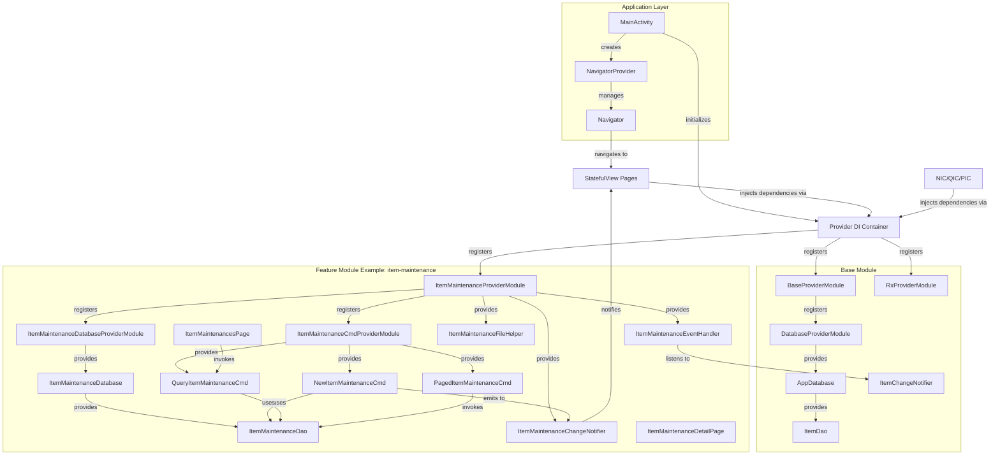
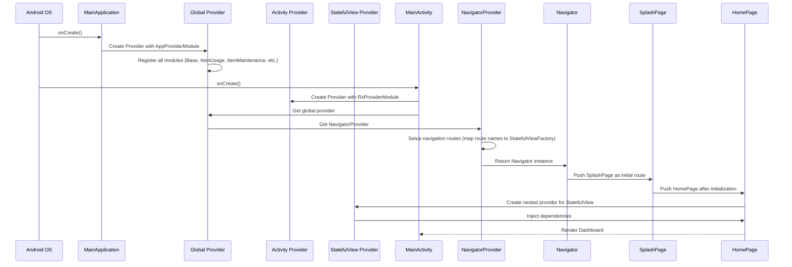
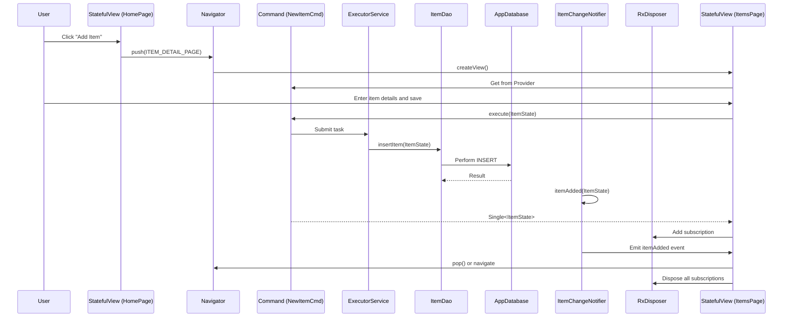

# a-personal-stuff


This is an open-source Native Android rewrite of the "My-Personal-Stuff" app (originally Flutter). It serves as a practical demonstration and production-ready implementation of the [a-navigator](https://github.com/rh-id/a-navigator) and [a-provider](https://github.com/rh-id/a-provider) libraries.

The app is designed to track, manage, and remind you of your personal belongings—whether it's tracking food expiration, organizing warehouse-like logistics at home, or managing maintenance schedules.

## Features
*   **Item Management**: Easily add, edit, and organize items.
*   **Smart Reminders**: Set up notifications for expiration dates or custom events.
*   **Usage Tracking**: Log when and how much of an item is used.
*   **Maintenance Logs**: Keep track of repairs or maintenance tasks for specific items.
*   **Barcode Support**: Scan barcodes for quick input and searching.

## User Workflow

The application is designed around a central Dashboard (`HomePage`) that provides quick access to all major functions.

1.  **Dashboard**: The entry point where you can navigate to different lists or quickly add new entries.
2.  **Adding an Item**:
    *   Click "Add Item" on the dashboard.
    *   Fill in details (Name, Image, Tags).
    *   Save to store it in the local database.
3.  **Tracking Usage/Maintenance/Reminders**:
    *   These are linked to specific items.
    *   From the dashboard, click "Add Usage" or "Add Maintenance".
    *   Select the target item from the list.
    *   Log the details (e.g., amount used, maintenance performed).

## Architecture & Modular Design

This project follows a **Modular Single-Activity Architecture**, emphasizing separation of concerns and scalability.

### Core Libraries
*   **[a-navigator](https://github.com/rh-id/a-navigator)**: Handles navigation. The app uses a single `MainActivity`, and all screens are implemented as `StatefulView`s (View-based architecture) rather than Fragments or Activities.
*   **[a-provider](https://github.com/rh-id/a-provider)**: A lightweight Dependency Injection (DI) framework used to manage services, repositories, and UI components.
*   **RxJava3**: Used heavily for reactive programming, handling asynchronous operations, and event buses.

### Modular Structure
The codebase is split into feature-centric modules to enforce boundaries:

| Module | Purpose |
|--------|---------|
| `:app` | Main entry point containing MainActivity, DI setup, navigation routing, and app-level commands for Item CRUD operations |
| `:base` | Shared utilities, entities (Item, ItemImage, ItemTag), common DAOs, base provider modules, Rx utilities, logging infrastructure, and shared UI components (AppBar, ImageSV, SelectionPage) |
| `:barcode` | Barcode scanning functionality using Camera2 API with ScanBarcodePage and ScanBarcodePreview components |
| `:item-usage` | Item usage tracking feature with entities (ItemUsage, ItemUsageImage), commands, DAO, and UI pages (ItemUsagesPage, ItemUsageDetailPage) |
| `:item-maintenance` | Item maintenance tracking with entities (ItemMaintenance, ItemMaintenanceImage), commands, DAO, and UI pages (ItemMaintenancesPage, ItemMaintenanceDetailPage) |
| `:item-reminder` | Reminder and alarm scheduling using WorkManager with entities (ItemReminder), commands, DAO, and UI pages (ItemRemindersPage, ItemReminderDetailPage) |
| `:settings` | App configuration and preferences with SettingsPage, theme management, log viewing, and license display |

### Database Strategy
Instead of a monolithic database, the app uses **Multiple Room Databases**, one for each feature module:

| Database | Module | Entities |
|----------|--------|----------|
| `AppDatabase` | base | AndroidNotification, Item, ItemImage, ItemTag |
| `ItemMaintenanceDatabase` | item-maintenance | ItemMaintenance, ItemMaintenanceImage |
| `ItemUsageDatabase` | item-usage | ItemUsage, ItemUsageImage |
| `ItemReminderDatabase` | item-reminder | ItemReminder |

This ensures that modules remain decoupled and can be maintained or extracted independently. Each database has its own DAO registered separately to decouple from the database instance.

### Architectural Patterns

#### 1. Single-Activity Architecture with StatefulView Pattern
- Single `MainActivity` hosts all screens via `Navigator`
- All pages implement `StatefulView<Activity>` instead of using Fragments
- StatefulView lifecycle: `createView()` → `dispose()`
- Navigation uses route strings defined in `Routes` class
- Route configuration in `NavigatorProvider` maps route names to StatefulViewFactory

#### 2. Dependency Injection (DI) with a-provider
- Global Provider scope (Application-level) initialized in `MainApplication`
- Activity Provider scope (Activity-level) created in `MainActivity`
- StatefulView Provider scope (View-level) created per page
- Modules register dependencies using `ProviderModule` interface
- Registration types:
  - `register()`: Eager instantiation
  - `registerLazy()`: Lazy instantiation (created on first access)
  - `registerAsync()`: Asynchronous instantiation (created in background)
  - `registerPool()`: Pool of instances for StatefulViews

#### 3. Command Pattern
Business logic is encapsulated using the **Command Pattern**:
- Commands are stateless classes (e.g., `NewItemCmd`, `QueryItemCmd`, `PagedItemMaintenanceCmd`)
- Each command performs a specific business operation
- Commands execute on background threads via `ExecutorService`
- Commands return RxJava types (`Single<T>`, `Observable<T>`) to the UI
- Example: `NewItemCmd.execute(ItemState)` returns `Single<ItemState>`

#### 4. Event Bus / Notifier Pattern
- Each module has a `ChangeNotifier` class for event-driven updates
- Notifiers use RxJava `PublishSubject` to emit events
- Notifiers expose `Flowable` streams for subscribers
- Pattern: `itemAdded()`, `itemUpdated()`, `itemDeleted()` → `getAddedItemFlow()`, `getUpdatedItemFlow()`, `getDeletedItemFlow()`
- Event handlers (`*EventHandler` classes) listen to base module events and trigger feature-specific actions
- Example: `ItemMaintenanceEventHandler` listens to `ItemChangeNotifier` and handles cascade deletions

#### 5. Repository Pattern
- Repositories encapsulate data access logic
- Example: `AndroidNotificationRepo` wraps `AndroidNotificationDao`
- Repositories handle complex queries and data transformations

### Architecture Diagram



### Logical Flow

#### Startup Sequence
1.  **MainApplication**: Initializes global `Provider` (DI container) and registers `AppProviderModule` with all feature modules
2.  **MainActivity**:
    *   Creates Activity-scoped Provider with `RxProviderModule`
    *   Retrieves global Provider via `BaseApplication.of(this).getProvider()`
    *   Gets `NavigatorProvider` which sets up navigation routes
    *   Sets up `RxDisposer` for subscription lifecycle
    *   Sets up theme change listener via `SettingsSharedPreferences`
    *   Registers back press handler
    *   Processes any pending notifications
3.  **Navigator**:
    *   Loads `SplashPage` as initial route
    *   After initialization (or splash timeout), routes to `HomePage`
4.  **HomePage**:
    *   Creates nested Provider for StatefulView scope
    *   Injects required dependencies (`ExecutorService`, `AppNotificationHandler`, `RxDisposer`, `QueryItemCmd`)
    *   Sets up drawer navigation and button click handlers
    *   Subscribes to notification events to navigate to appropriate pages



#### Runtime Interaction Flow
1.  **User Interaction**: User clicks a button in a `StatefulView` (e.g., "Add Item")
2.  **Navigation**: `Navigator.push(routeName)` navigates to new StatefulView
3.  **View Creation**: New StatefulView's `createView()` is called
4.  **Dependency Injection**: StatefulView injects required Commands via Provider
5.  **Command Execution**: User input triggers `Command.execute()` method
6.  **Background Execution**: Command runs on `ExecutorService` background thread
7.  **Database Access**: Command uses DAO to perform database operations
8.  **Event Emission**: Notifier emits event via `PublishSubject`
9.  **UI Update**: RxJava subscription observes Flowable and updates UI on main thread
10. **Cleanup**: When StatefulView is disposed, `RxDisposer` clears all subscriptions



### Project Structure

```
a-personal-stuff/
├── app/                           # Main application module
│   ├── src/main/java/m/co/rh/id/a_personal_stuff/app/
│   │   ├── MainActivity.java      # Single activity hosting all views
│   │   ├── MainApplication.java   # Application class with global provider
│   │   ├── provider/
│   │   │   ├── AppProviderModule.java          # Root DI module registration
│   │   │   ├── NavigatorProvider.java          # Navigation route setup
│   │   │   ├── StatefulViewProvider.java       # StatefulView-scoped provider
│   │   │   ├── CommandProviderModule.java      # App-level commands
│   │   │   ├── component/
│   │   │   │   └── AppNotificationHandler.java # Notification processing
│   │   │   └── command/
│   │   │       ├── NewItemCmd.java             # Create item command
│   │   │       ├── UpdateItemCmd.java          # Update item command
│   │   │       ├── DeleteItemCmd.java          # Delete item command
│   │   │       ├── QueryItemCmd.java           # Query item command
│   │   │       ├── PagedItemCmd.java           # Paged item query
│   │   │       └── *Item{Tag/Image}Cmd.java    # Tag/Image commands
│   │   └── ui/
│   │       ├── page/
│   │       │   ├── SplashPage.java             # Splash screen
│   │       │   ├── HomePage.java               # Main dashboard
│   │       │   ├── ItemsPage.java              # Item list
│   │       │   ├── ItemDetailPage.java        # Item add/edit
│   │       │   ├── ItemSelectPage.java        # Item selection dialog
│   │       │   └── DonationsPage.java         # Donation page
│   │       └── component/
│   │           ├── item/
│   │           │   ├── ItemListSV.java        # Item list StatefulView
│   │           │   ├── ItemItemSV.java         # Item item StatefulView
│   │           │   └── ItemAdapter.java       # RecyclerView adapter
│   │           └── adapter/
│   │               └── ItemSuggestionAdapter.java
│
├── base/                         # Shared base module
│   ├── src/main/java/m/co/rh/id/a_personal_stuff/base/
│   │   ├── BaseApplication.java              # Base application class
│   │   ├── constants/
│   │   │   ├── Constants.java                # App constants (DB names)
│   │   │   └── Routes.java                   # Route name constants
│   │   ├── entity/
│   │   │   ├── Item.java                     # Item entity
│   │   │   ├── ItemImage.java                # Item image entity
│   │   │   ├── ItemTag.java                  # Item tag entity
│   │   │   ├── AndroidNotification.java     # Notification entity
│   │   │   └── ItemState.java                # Item state model
│   │   ├── dao/
│   │   │   ├── ItemDao.java                  # Item data access object
│   │   │   └── AndroidNotificationDao.java  # Notification DAO
│   │   ├── room/
│   │   │   ├── AppDatabase.java              # Main Room database
│   │   │   └── converter/Converter.java       # Type converters
│   │   ├── repository/
│   │   │   └── AndroidNotificationRepo.java  # Notification repository
│   │   ├── provider/
│   │   │   ├── BaseProviderModule.java       # Base DI module
│   │   │   ├── DatabaseProviderModule.java   # Database DI module
│   │   │   ├── RxProviderModule.java         # RxJava DI module
│   │   │   ├── notifier/
│   │   │   │   └── ItemChangeNotifier.java   # Item change event bus
│   │   │   ├── component/
│   │   │   │   ├── ItemFileHelper.java       # File operations
│   │   │   │   └── FileHelper.java           # Base file helper
│   │   │   └── IStatefulViewProvider.java    # SV provider interface
│   │   ├── rx/
│   │   │   └── RxDisposer.java               # Subscription manager
│   │   ├── ui/
│   │   │   ├── component/
│   │   │   │   └── AppBarSV.java             # App bar StatefulView
│   │   │   ├── page/
│   │   │   │   ├── common/
│   │   │   │   │   ├── ImageSV.java          # Image viewer SV
│   │   │   │   │   ├── ImageViewPage.java    # Image viewer page
│   │   │   │   │   └── SelectionPage.java    # Selection dialog
│   │   │   └── recyclerview/
│   │   │       └── CustomLinearLayoutManager.java
│   │   └── util/
│   │       └── UiUtils.java                  # UI utilities
│
├── item-maintenance/             # Item maintenance feature module
│   ├── src/main/java/m/co/rh/id/a_personal_stuff/item_maintenance/
│   │   ├── entity/
│   │   │   ├── ItemMaintenance.java          # Maintenance entity
│   │   │   ├── ItemMaintenanceImage.java     # Maintenance image entity
│   │   │   └── ItemMaintenanceState.java     # Maintenance state model
│   │   ├── dao/
│   │   │   └── ItemMaintenanceDao.java       # Maintenance DAO
│   │   ├── room/
│   │   │   └── ItemMaintenanceDatabase.java  # Maintenance Room database
│   │   ├── provider/
│   │   │   ├── ItemMaintenanceProviderModule.java
│   │   │   ├── ItemMaintenanceDatabaseProviderModule.java
│   │   │   ├── ItemMaintenanceCmdProviderModule.java
│   │   │   ├── command/
│   │   │   │   ├── NewItemMaintenanceCmd.java
│   │   │   │   ├── UpdateItemMaintenanceCmd.java
│   │   │   │   ├── DeleteItemMaintenanceCmd.java
│   │   │   │   ├── QueryItemMaintenanceCmd.java
│   │   │   │   └── PagedItemMaintenanceCmd.java
│   │   │   ├── component/
│   │   │   │   ├── ItemMaintenanceFileHelper.java
│   │   │   │   └── ItemMaintenanceEventHandler.java
│   │   │   └── notifier/
│   │   │       └── ItemMaintenanceChangeNotifier.java
│   │   └── ui/
│   │       ├── page/
│   │       │   ├── ItemMaintenancesPage.java
│   │       │   └── ItemMaintenanceDetailPage.java
│   │       └── component/
│   │           ├── ItemMaintenanceListSV.java
│   │           └── ItemMaintenanceItemSV.java
│
├── item-usage/                  # Item usage tracking module
│   └── (Similar structure to item-maintenance)
│
├── item-reminder/               # Item reminder/notification module
│   ├── src/main/java/m/co/rh/id/a_personal_stuff/item_reminder/
│   │   ├── entity/
│   │   │   └── ItemReminder.java
│   │   ├── dao/
│   │   │   └── ItemReminderDao.java
│   │   ├── room/
│   │   │   └── ItemReminderDatabase.java
│   │   ├── provider/
│   │   │   ├── ItemReminderProviderModule.java
│   │   │   ├── ItemReminderDatabaseProviderModule.java
│   │   │   ├── ItemReminderCmdProviderModule.java
│   │   │   ├── command/
│   │   │   │   ├── NewItemReminderCmd.java
│   │   │   │   ├── DeleteItemReminderCmd.java
│   │   │   │   ├── QueryItemReminderCmd.java
│   │   │   │   └── PagedItemReminderCmd.java
│   │   │   ├── component/
│   │   │   │   ├── ItemReminderEventHandler.java
│   │   │   │   └── IItemReminderNotificationHandler.java
│   │   │   └── notifier/
│   │   │       └── ItemReminderChangeNotifier.java
│   │   ├── ui/
│   │   │   ├── page/
│   │   │   │   ├── ItemRemindersPage.java
│   │   │   │   └── ItemReminderDetailPage.java
│   │   │   └── component/
│   │   │       ├── ItemReminderListSV.java
│   │   │       └── ItemReminderItemSV.java
│   │   └── workmanager/
│   │       ├── WorkManagerConstants.java
│   │       └── worker/
│   │           └── ItemReminderNotificationWorker.java
│
├── barcode/                      # Barcode scanning module
│   ├── src/main/java/m/co/rh/id/a_personal_stuff/barcode/
│   │   ├── provider/
│   │   │   └── BarcodeProviderModule.java
│   │   ├── ui/
│   │   │   ├── NavBarcodeConfig.java        # Navigation configuration
│   │   │   ├── ScanBarcodePage.java         # Barcode scanner page
│   │   │   └── component/
│   │   │       └── ScanBarcodePreview.java  # Camera preview
│
├── settings/                     # Settings module
│   ├── src/main/java/m/co/rh/id/a_personal_stuff/settings/
│   │   ├── provider/
│   │   │   ├── SettingsProviderModule.java
│   │   │   └── component/
│   │   │       └── SettingsSharedPreferences.java
│   │   └── ui/
│   │       ├── page/
│   │       │   ├── SettingsPage.java        # Main settings page
│   │       │   ├── LogPage.java             # Log viewer
│   │       │   └── LicensesPage.java        # Licenses display
│   │       └── component/
│   │           ├── ThemeMenuSV.java         # Theme selector
│   │           ├── VersionMenuSV.java       # Version display
│   │           ├── LogMenuSV.java           # Log menu
│   │           └── LicensesMenuSV.java     # Licenses menu
│
├── graphics/                     # App graphics (launcher icon, etc.)
├── fastlane/                     # App store metadata (descriptions, screenshots)
│   ├── metadata/android/en-US/
│   │   ├── images/               # Screenshots and feature graphic
│   │   ├── full_description.txt
│   │   ├── short_description.txt
│   │   └── title.txt
│   └── README.md
│
├── .github/workflows/            # CI/CD pipelines
│   ├── gradlew-build.yml         # Build verification
│   ├── android-release.yml      # Release build automation
│   └── android-emulator-test.yml # Emulator testing
│
├── build.gradle                  # Root build configuration
├── settings.gradle               # Project module configuration
├── gradle.properties            # Gradle properties (room_version, nav_version)
└── README.md                     # This file
```

### Key Architectural Details

#### Dependency Injection Scopes
```
Application Scope (MainApplication)
  └── Global Provider
      ├── BaseProviderModule (executors, logger, WorkManager, base DB)
      ├── RxProviderModule (Rx utilities)
      ├── FeatureProviderModules (each feature's DI setup)
      ├── NavigatorProvider (navigation configuration)
      └── Notifiers (event publishers)

Activity Scope (MainActivity)
  └── Activity Provider
      ├── RxDisposer (subscription lifecycle)
      └── Navigator (navigation instance)

StatefulView Scope (each page)
  └── StatefulView Provider (nested)
      ├── Commands (business logic)
      ├── Component handlers
      └── View-specific dependencies
```

#### Threading Model
- **ExecutorService**: Weighted thread pool with max weight 5 for general async operations
- **ScheduledExecutorService**: Single-threaded for scheduled tasks
- **WorkManager**: For background notifications and reminders
- **RxJava Schedulers**:
  - `Schedulers.from(executorService)`: Background execution for commands
  - `AndroidSchedulers.mainThread()`: UI updates
  - `observeOn()` and `subscribeOn()` for thread switching

#### Event Flow Example
When an item is deleted:
1. `DeleteItemCmd.execute()` called with `ItemState`
2. Command deletes item from `AppDatabase` via `ItemDao`
3. `ItemChangeNotifier.itemDeleted(itemState)` emits event
4. `ItemMaintenanceEventHandler` subscribes to `ItemChangeNotifier`
5. On `itemDeleted` event, handler deletes related maintenance records
6. Similar flow for `ItemUsageEventHandler` and `ItemReminderEventHandler`

#### State Management
- **ItemState**: Aggregate of Item, ItemImages, and ItemTags
- **Feature-specific states**: `ItemMaintenanceState`, `ItemUsageState`
- States are passed between views via navigation arguments
- States are cloned before modification to avoid reference issues

#### File Management
- `FileHelper`: Base class for file operations (app directory management)
- `ItemFileHelper`: Manages item-related files (images, etc.)
- `ItemMaintenanceFileHelper`: Manages maintenance-related files
- File deletion cascades through event handlers

### Technology Stack
| Layer | Technology |
|-------|-----------|
| **Language** | Java 17 |
| **Build System** | Gradle 8.14.3 (Android Gradle Plugin 8.13.2) |
| **Min SDK** | 21 (Android 5.0 Lollipop) |
| **Target SDK** | 33 (Android 13) |
| **DI Framework** | [a-provider](https://github.com/rh-id/a-provider) v0.0.23 |
| **Navigation** | [a-navigator](https://github.com/rh-id/a-navigator) v0.0.66 |
| **Database** | Room 2.5.1 |
| **Async** | RxJava 3.1.4, RxAndroid 3.0.0 |
| **Logging** | [a-logger](https://github.com/rh-id/a-logger) v0.0.3 |
| **UI** | AndroidX, Material Design |
| **Background Tasks** | WorkManager 2.8.1 |
| **Image Viewer** | PhotoView 2.3.0 |
| **Barcode** | Camera2 API |
| **Concurrency** | concurrent-utils v0.0.3 (WeightedThreadPool) |
| **Memory Leaks** | LeakCanary Plumber 2.9.1 |
| **Desugaring** | Android Desugar Libs 2.0.4 |

## Automation & CI/CD

The project leverages automation to ensure quality and streamline releases.

### GitHub Actions
Located in `.github/workflows/`, the project has three main pipelines:

1.  **Android CI (`gradlew-build.yml`)**:
    *   Triggers on push/PR to `master`
    *   Runs `./gradlew build` to ensure project builds successfully
    *   Verifies compilation and basic checks

2.  **Android Release (`android-release.yml`)**:
    *   Triggers when a tag starting with `v*` is pushed (e.g., `v1.3.0`)
    *   Builds release APK with signing
    *   Uses repository secrets for signing configuration:
        *   `SIGNING_KEY`: Base64-encoded keystore
        *   `KEY_STORE_PASSWORD`: Keystore password
        *   `ALIAS`: Key alias
        *   `KEY_PASSWORD`: Key password
    *   Creates GitHub Release with:
        *   Release APK artifact
        *   Changelog from `fastlane/metadata/android/en-US/changelogs/{versionCode}.txt`

3.  **Emulator Test (`android-emulator-test.yml`)**:
    *   Runs instrumented tests on Android emulator
    *   Verifies UI and integration tests pass

### Fastlane
The `fastlane/` directory contains metadata for store listings:
- `metadata/android/en-US/`: Store metadata for English (US)
  - `images/featureGraphic.png`: Feature graphic (1024x500)
  - `images/icon.png`: App icon (512x512)
  - `images/phoneScreenshots/`: Phone screenshots (1.png to 4.png)
  - `full_description.txt`: Full app description
  - `short_description.txt`: Short app description (80 characters max)
  - `title.txt`: App title
  - `changelogs/{versionCode}.txt`: Per-version changelog

This structure allows for version-controlled store presence management.

## Testing

The project includes testing infrastructure:
- **Unit Tests**: JUnit 4.13.2
- **Android Instrumented Tests**: AndroidX Test, Espresso 3.5.1
- **Room Database Testing**: Room Testing 2.5.1 (uses exported schemas in `schemas/` directories)
- **Test Runner**: AndroidJUnitRunner

To run tests:
```bash
# Run unit tests
./gradlew test

# Run instrumented tests (requires connected device/emulator)
./gradlew connectedAndroidTest
```

## Building the Project

### Prerequisites
- JDK 17 or higher
- Android SDK 33
- Gradle (via Gradle Wrapper included)

### Build Commands
```bash
# Build debug APK
./gradlew assembleDebug

# Build release APK (requires signing)
./gradlew assembleRelease

# Clean build
./gradlew clean
```

### Build Artifacts
- **Debug APK**: `app/build/outputs/apk/debug/app-debug.apk`
- **Release APK**: `app/build/outputs/apk/release/app-release.apk`

## Screenshots


## Support this project
Consider donation to support this project
<table>
  <tr>
    <td><a href="https://trakteer.id/rh-id">https://trakteer.id/rh-id</a></td>
  </tr>
</table>

## License

This project is licensed under the [GPL-3.0 License](LICENSE).
