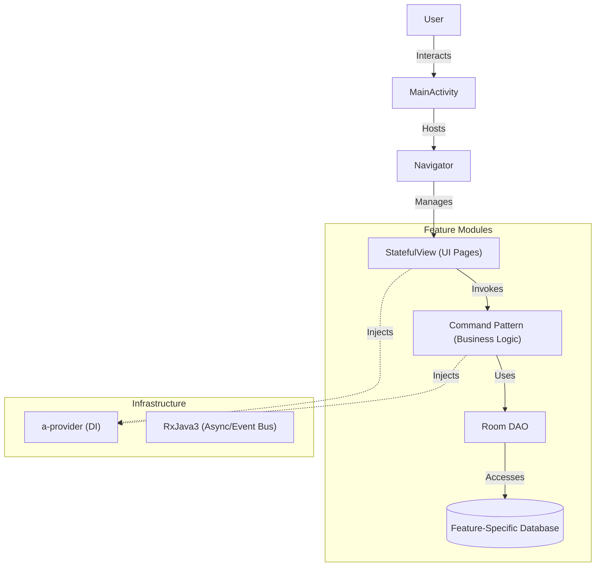
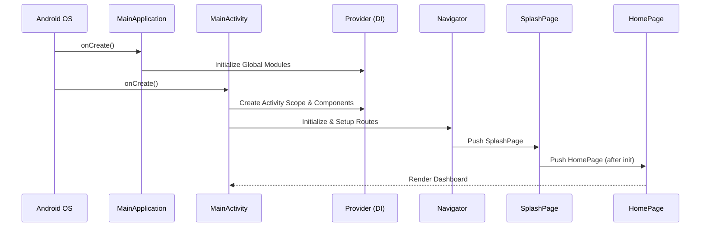

# a-personal-stuff

This is an open-source Native Android rewrite of the "My-Personal-Stuff" app (originally Flutter). It serves as a practical demonstration and production-ready implementation of the [a-navigator](https://github.com/rh-id/a-navigator) and [a-provider](https://github.com/rh-id/a-provider) libraries.

The app is designed to track, manage, and remind you of your personal belongings—whether it's tracking food expiration, organizing warehouse-like logistics at home, or managing maintenance schedules.

## Features
*   **Item Management**: Easily add, edit, and organize items.
*   **Smart Reminders**: Set up notifications for expiration dates or custom events.
*   **Usage Tracking**: Log when and how much of an item is used.
*   **Maintenance Logs**: Keep track of repairs or maintenance tasks for specific items.
*   **Barcode Support**: Scan barcodes for quick input and searching.

## User Workflow

The application is designed around a central Dashboard (`HomePage`) that provides quick access to all major functions.

1.  **Dashboard**: The entry point where you can navigate to different lists or quickly add new entries.
2.  **Adding an Item**: 
    *   Click "Add Item" on the dashboard.
    *   Fill in details (Name, Image, Tags).
    *   Save to store it in the local database.
3.  **Tracking Usage/Maintenance/Reminders**:
    *   These are linked to specific items.
    *   From the dashboard, click "Add Usage" or "Add Maintenance".
    *   Select the target item from the list.
    *   Log the details (e.g., amount used, maintenance performed).

## Architecture & Modular Design

This project follows a **Modular Single-Activity Architecture**, emphasizing separation of concerns and scalability.

### Core Libraries
*   **[a-navigator](https://github.com/rh-id/a-navigator)**: Handles navigation. The app uses a single `MainActivity`, and all screens are implemented as `StatefulView`s (View-based architecture) rather than Fragments or Activities.
*   **[a-provider](https://github.com/rh-id/a-provider)**: A lightweight Dependency Injection (DI) framework used to manage services, repositories, and UI components.
*   **RxJava3**: Used heavily for reactive programming, handling asynchronous operations, and event buses.

### Modular Structure
The codebase is split into feature-centric modules to enforce boundaries:
*   `:app`: The main entry point, containing the `MainActivity`, DI setup, and wiring for all modules.
*   `:base`: Common entities, utilities, and shared UI components.
*   `:barcode`: Barcode scanning functionality.
*   `:item-usage`: Logic and UI for tracking item usage.
*   `:item-maintenance`: Logic and UI for item maintenance logs.
*   `:item-reminder`: Notification and alarm scheduling logic.
*   `:settings`: App configuration and preferences.

### Database Strategy
Instead of a monolithic database, the app uses **multiple Room Databases**, one for each feature module (e.g., `ItemUsageDatabase`, `ItemMaintenanceDatabase`). This ensures that modules remain decoupled and can be maintained or extracted independently.

### Command Pattern
Business logic is encapsulated using the **Command Pattern**. Instead of putting logic in Views or ViewModels, specific actions are defined as `Cmd` classes (e.g., `NewItemCmd`, `QueryItemCmd`).
*   **Benefit**: Decouples logic from UI.
*   **Execution**: Commands run on background threads (via `ExecutorService`) and return `RxJava` types (`Single`, `Observable`) to the UI.

### Architecture Diagram

## Code Execution Flow

### Startup Sequence
1.  **MainApplication**: Initializes the global `Provider` (DI container) and registers module configurations.
2.  **MainActivity**: 
    *   Creates the Activity-scoped Provider.
    *   Initializes the `Navigator`.
    *   Sets up the `RxDisposer` to handle subscription lifecycles.
3.  **Navigator**:
    *   Loads the `SplashPage`.
    *   After initialization, routes to `HomePage`.
4.  **HomePage**:
    *   The user lands on the dashboard, ready to interact.

## Automation & CI/CD

The project leverages automation to ensure quality and streamline releases.

### GitHub Actions
Located in `.github/workflows/`, the project has three main pipelines:
1.  **Android CI (`gradlew-build.yml`)**: Runs on every push/PR to `master` to ensure the project builds successfully.
2.  **Android Release (`android-release.yml`)**: Triggered when a tag starting with `v*` is pushed. It builds the release APK, signs it using repository secrets, and creates a GitHub Release with a changelog.
3.  **Emulator Test (`android-emulator-test.yml`)**: Runs instrumented tests on an Android emulator.

### Fastlane
The `fastlane/` directory contains metadata (images, changelogs, descriptions) used for store listings. This structure allows for version-controlled store presence management.

## Screenshots

## Support this project
Consider donation to support this project
<table>
  <tr>
    <td><a href="https://trakteer.id/rh-id">https://trakteer.id/rh-id</a></td>
  </tr>
</table>
